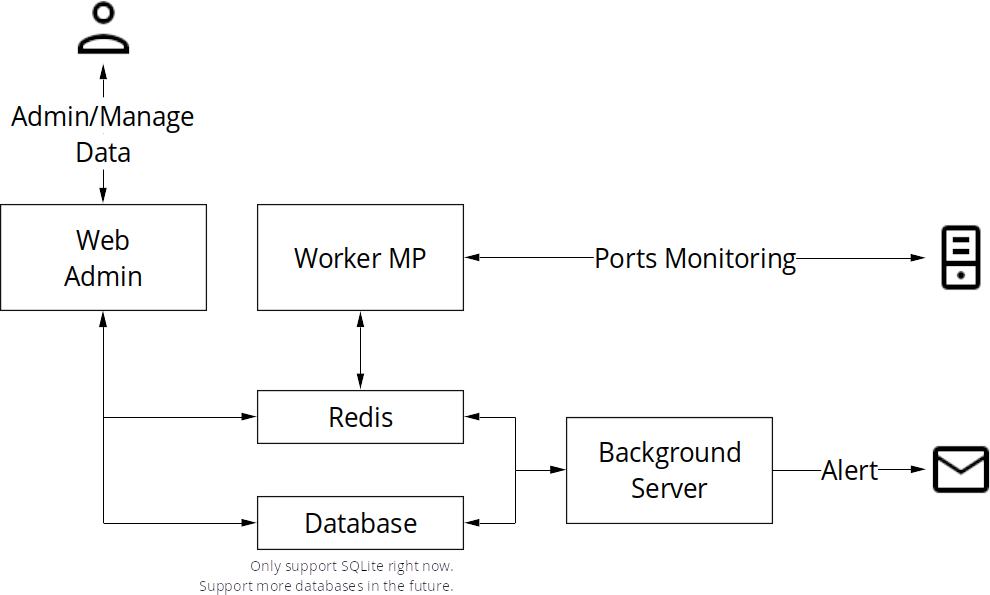
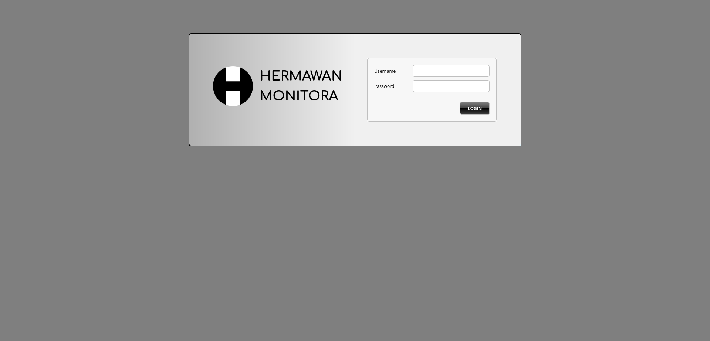

# Hermawan Monitora Worker-MP
Hermawan-Monitora is a free open-source monitoring application.

Now in this version 0.02, there are two main monitoring features:

* **Service Health Monitoring**, monitors services through TCP ports and detects whether services are up or down.
* **Domain SSL Certificate Monitoring**, monitors domain SSL certificate expiration dates and sends alerts when certificates are near expiration.

The system is also capable of sending alert emails.

What’s new in Version 0.02:

* Added monitoring for domain SSL certificate expiration dates.
* Worker renamed to Worker-MP because it specializes in port monitoring only.
* Worker-MP source code migrated from Python to Golang for better performance and to remove the dependency on nmap.
* Bug fixes, especially in the Settings module.

**NOTE:** More features will be added in future releases.  

**IMPORTANT:**  
The Hermawan Monitora Worker-MP is a part of Hermawan Monitora applications, so it can't run independently, please check other components:

* [Hermawan Monitor Background-Server](https://github.com/ming-hermawan/hermawan-monitora-bgserver)
* [Hermawan Monitor Web-Admin](https://github.com/ming-hermawan/hermawan-monitora-webadmin)

## License
[MIT](https://choosealicense.com/licenses/mit/)

## How it Works

Hermawan Monitora has three main components:

1. The **Background-Server**:
    * Checks domain SSL certificate expiration dates
    * Receives monitoring results from Worker-MP
    * Sends alert emails based on configured rules

2. The **Web-Admin** provides a dashboard for administrators to:
    * Configure monitoring targets
    * Manage users and permissions
    * View monitoring status and reports

3. The **Worker-MP**:
    * Scans services via TCP ports
    * Saves monitoring results to Redis

All components communicate through Redis.

<p align="center"></p>

SQLite is used as the default database, in the future, support for additional databases such as MySQL and PostgreSQL is planned.

## Installation

### Installation with Docker

**Prerequisites:**

    * Docker
    * Docker Compose

**Steps:**

1. Create a folder as the main folder.
2. Create folders inside the main folder:

    * `./shared/data/sqlite`, for a SQLite database folder.
    * `./shared/data/pic`, for uploaded pictures folder.
    * `./shared/out/bgserver`, Background-Server log folder.
    * `./shared/out/webadmin`, Web-Admin log folder.
    * `./shared/out/worker-mp`, Worker-MP log folder.

    If you separate Worker-MP from other services, in Background-Server and Web-Admin create folders:

    * ./shared/data/sqlite
    * ./shared/data/pic
    * ./shared/out/bgserver
    * ./shared/out/webadmin

    In the Worker-MP just create a `./shared/out/worker-mp` folder.

3. Write a docker-compose.yml below inside the main folder:

```
services:
  hermawan_monitora_redis:
    image: redis:7.4-rc2-bookworm
    container_name: hermawan_monitora_redis
    privileged: true
    ports:
      - "6379:6379"
    environment:
      - REDIS_PORT=6379
  hermawan_monitora_bgserver:
    image: minghermawan/hermawan_monitora_bgserver:0.02
    container_name: hermawan_monitora_bgserver
    network_mode: host
    volumes:
      - ./shared/data/sqlite:/opt/hermawan-monitora/data/sqlite
      - ./shared/out/bgserver:/var/log/hermawan-monitora/bgserver
    environment:
      - REDIS_HOST=localhost
      - REDIS_PORT=6379
      - REDIS_DB=0
    depends_on:
      hermawan_monitora_redis:
        condition: service_started
  hermawan_monitora_webadmin:
    image: minghermawan/hermawan_monitora_webadmin:0.02
    container_name: hermawan_monitora_webadmin
    network_mode: host
    volumes:
      - ./shared/data/sqlite:/opt/hermawan-monitora/data/sqlite
      - ./shared/data/pic:/opt/hermawan-monitora/data/pic
      - ./shared/out/webadmin:/var/log/hermawan-monitora/webadmin
    depends_on:
      hermawan_monitora_redis:
        condition: service_started
      hermawan_monitora_bgserver:
        condition: service_started
    environment:
      - JWT_SIGNATURE_KEY=Hermawan
      - PORT=7200
      - REDIS_HOST=localhost
      - REDIS_PORT=6379
      - REDIS_DB=0
  hermawan_monitora_worker_mp:
    image: minghermawan/hermawan_monitora_worker_mp:0.02
    container_name: hermawan_monitora_worker_mp
    network_mode: host
    volumes:
      - ./shared/out/worker_mp:/var/log/hermawan-monitora/worker_mp
    environment:
      - REDIS_HOST=localhost
      - REDIS_PORT=6379
      - REDIS_DB=0
    depends_on:
      hermawan_monitora_redis:
        condition: service_started
      hermawan_monitora_bgserver:
        condition: service_started
```

**NOTE:**  
A docker-compose.yml above is just for example. You can change the composition to suit more with your environment and situation, but you need to understand how to set docker-compose.yml before you change it.
Check more explanation about this at the links below:

[How to Settings docker-compose.yml](./readme/how-to-settings-docker-compose-yml.md)

[All Docker Environment Variables information](./readme/docker-environment-variables.md)

4. Run `docker compose up --build -d`.
5. Open your web browser, go to `http://localhost:7200` to open the web admin dashboard.
    <p align="center"></p>
    
    **NOTE:**  
    Make sure **cookies** are enabled in your browser.
6. Default username & password is `admin`, `admin`.
    **NOTE:**  
    You can change the password later on the web admin dashboard.

### Install Locally

#### Linux
**Requirements:**
* Redis Server

**Installation:**

1. Download all packages:

    Linux **Debian/Ubuntu-based** system:

    * Hermawan Monitora Background-Server  
    https://github.com/ming-hermawan/hermawan-monitora-bgserver/releases/download/0.02/hermawan-monitora-bgserver.deb
    * Hermawan Monitora Web-Admin  
    https://github.com/ming-hermawan/hermawan-monitora-webadmin/releases/download/0.02/hermawan-monitora-webadmin.deb
    * Hermawan Monitora Worker-MP  
    https://github.com/ming-hermawan/hermawan-monitora-worker-mp/releases/download/0.02/hermawan-monitora-worker-mp.deb

    Linux **Red-Hat-based** system:

    * Hermawan Monitora Background-Server  
    https://github.com/ming-hermawan/hermawan-monitora-bgserver/releases/download/0.02/hermawan-monitora-bgserver-0.02-1.el9.x86_64.rpm
    * Hermawan Monitora Web-Admin  
    https://github.com/ming-hermawan/hermawan-monitora-webadmin/releases/download/0.02/hermawan-monitora-webadmin-0.02-1.el9.x86_64.rpm
    * Hermawan Monitora Worker-MP  
    https://github.com/ming-hermawan/hermawan-monitora-worker-mp/releases/download/0.02/hermawan-monitora-worker-mp-0.02-1.el9.x86_64.rpm

2. Install:

Linux **Debian/Ubuntu-based** system:

```sudo dpkg -i\
 hermawan-monitora-bgserver\
 hermawan-monitora-webadmin\
 hermawan-monitora-worker-mp;
```
Linux **Red-Hat-based** system:

```rpm -ivh\
 hermawan-monitora-bgserver-0.02-1.el9.x86_64.rpm\
 hermawan-monitora-webadmin-0.02-1.el9.x86_64.rpm\
 hermawan-monitora-worker-mp-0.02-1.el9.x86_64.rpm;
```
**NOTE:**  
Make sure to run a command inside the folder that contains downloaded files.

3. Update env files in:

    a. `/etc/hermawan-monitora/bgserver.env` for Hermawan Monitora Background-Server  
    b. `/etc/hermawan-monitora/webadmin.env` for Hermawan Monitora Web-Admin  
    c. `/etc/hermawan-monitora/worker-mp.env` for Hermawan Monitora Worker-MP  

    **IMPORTANT:**  
    1. Prepare the Redis server
    2. Prepare folders below before setting env files, because it's very important and these folders need to be set in env files.
        - Folder for SQLite database file
        - Folder for uploaded files
        - Folder for logs
    3. [Click here for more explanation about all env files](./readme/env-files.md)

4. Run: (Use nohup so these services run in background)

```
nohup hermawan-monitora-bgserver >> hermawan-monitora-bgserver.log 2>&1 &
nohup hermawan-monitora-webadmin >> hermawan-monitora-webadmin.log 2>&1 &
nohup hermawan-monitora-worker-mp >> hermawan-monitora-worker-mp.log 2>&1 &
```

**NOTE:**  
Sorry, I decided not to make this installation automatically run all the services in the background for security reasons because the installation uses sudo, so it's not secure.  
You can set all these services running in the background with SystemD, but you need knowledge about SystemD, so don't hesitate to ask and email me if you need my help with this.

5. Open your web browser, go to http://localhost:{Port Number}(Port number depends on what you set in the Web Admin env file, default 7200) to open the web admin dashboard.
    <p align="center"></p>

    **NOTE:**
    Make sure cookies are enabled in your browser.

6. Default username & password is admin, admin.

    **NOTE:**
    You can change the password later on the web admin dashboard.

#### Next, to learn more about Web Admin, check the PDF manual for a more complete guide about this application:
[Hermawan Monitor Manual](https://github.com/ming-hermawan/hermawan-monitora-manual/blob/master/hemawan-monitora-manual.pdf)

## Next Features

1. **Incident Manager (Hermawan IM)**
2. Grafana integration
3. Charts in the Web Admin dashboard
4. More advanced reports
5. Of course, there’s always room for optimization
6. Suggest to me what's next in features
So please support this application, your support means a lot to me.

Ask anything to me, don’t hesitate to send me emails at minghermawan@yahoo.com.

Linkedin:
https://www.linkedin.com/in/hermawan-ho-a3801194/
